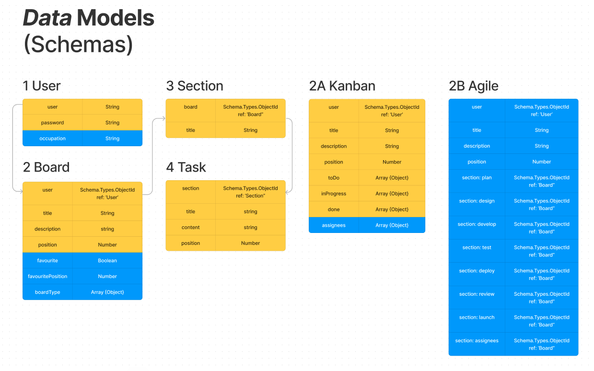

# SYNC

Synchonise Your Next Collaboration

---

# About

This is an app built with the MERN Stack(MongoDB, Express, React, Node). It's a simple task tracking app that can be developed and adopted into a more complex and useful tool.

---

# Purpose
The purpose of developing this App is to create a simple project management tool for people of all ages.

---

# Features
- Register and Login
- Create, read, update and delete boards
- Create, read, update and delete lists
- Create, read, update and delete tasks
- Drag and drop lists or tasks
- Add a board to a fav.

---



---

# TODO

- Upload attachements
- Add members
- Search projects
- Add colour, labels, begin and end dates
- Signin or Register through gmail.

---

# Used Technologies
<style scoped>
table {
  font-size: 20px;
}
</style>

| Frontend      	    | Backend              | Development     |
|-------------------  |--------------------- |---------------	 |
| react         	    | express              | nodemon         |
| react-router-dom    | dotenv               |                 |
| react-redux    	    | cors                 |                 |
| @reduxjs-toolkit    | express-validator    |                 |
| react-beautiful-dnd | jsonwebtoken         |                 |
| query-string   	    | mongoose             |                 |
| axios         	    | crypto-js            |                 |
| @mui/material 	    |                      |                 |
| @mui/lab      	    |                      |                 |
| @ckeditor           |                      |                 |

---

# How to run?
<style scoped>
ul {
  font-size: 17px;
}
</style>
- Download nodejs [here](https://nodejs.org/en/download/) 
- For database, you can use local mongodb or mongo atlas (See [here](https://www.mongodb.com/)).
- Clone the repository:
  ```git clone git@github.com:shennamt/sync-frontend.git``` 

- CD into directory:
  ```cd sync-frontend```
  ```npm install```
  ```npm run start```

- Change directory of terminal and install the backend:
  ```git clone git@github.com:shennamt/sync-backend.git```
  ```cd sync-backend```
  ```npm install```
  ```npm run start```

- Create .env file in server directory and enter required variables